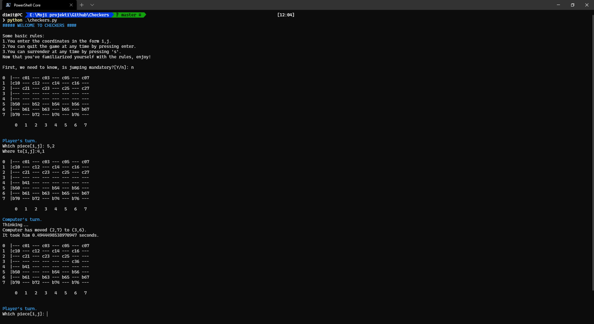

# Checkers
A game of checkers written using minmax algorithm and alpha-beta prunning.

The bot should play its moves in under 5 seconds.

How to use:

$ python checkers.py <lang>

ie:
$ python checkers.py en

How to contribute:
create a language file in lang/ folder and make a pull request